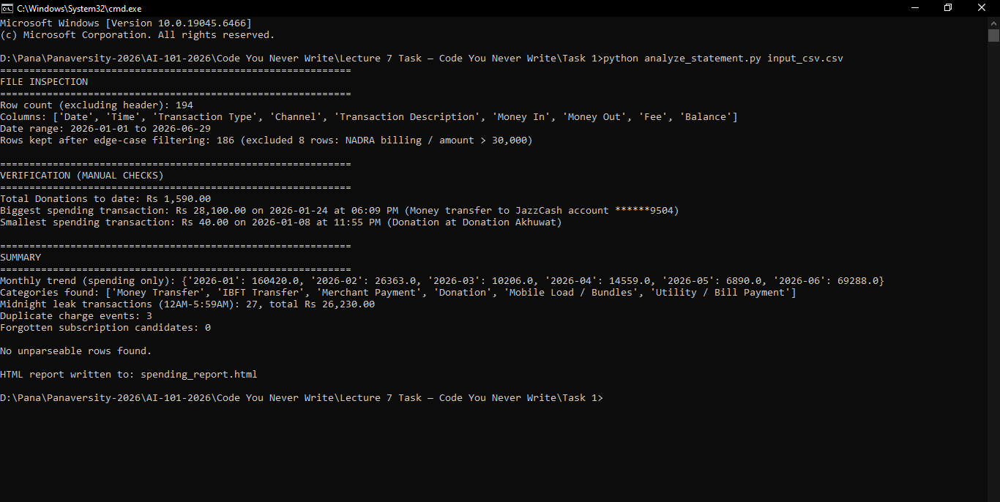
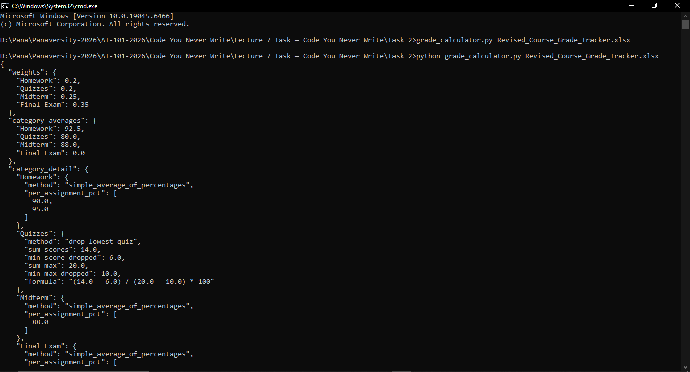
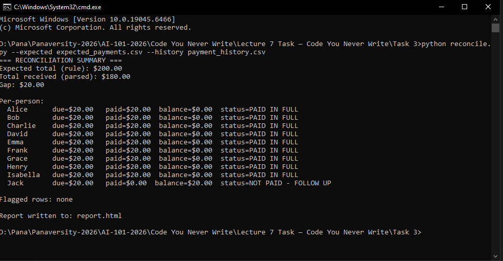
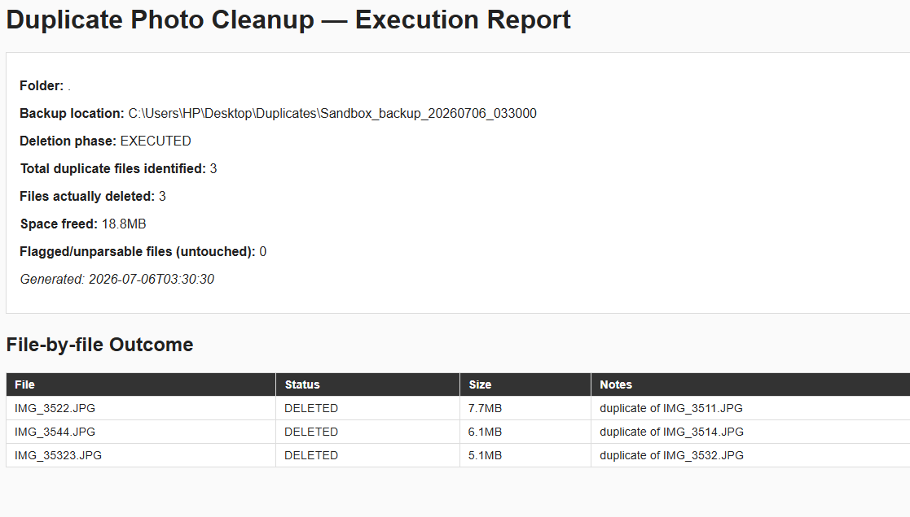

## Tools Used

Claude Code

## Tasks

- **Money Detective**: Create a script to analyze your transaction history for spending leaks and forgotten subscriptions.
- Result:
  
- **What’s My Grade**: Encode your teacher's specific grading rules to calculate your exact current standing and required final exam scores.
- Result:
  
- **The Books Don’t Match**: Use AI to reconcile messy digital payment records against a hand-counted total to find missing funds.
- Result:
  
- **Organize the Mess**: Safely manage digital clutter by requiring the AI to perform "dry runs" and plan file operations before execution.
- Result:
  

## Prompt Format Sample

```
# Goal

Calculate the Grade based on grading rules. An accurate picture of where you actually stand, plus the specific final-exam score you need to hit the grade you are aiming for.

# Input

Attached is an xlsx file 'Revised_Course_Grade_Tracker.xlsx' containing the real scores (assignments, quizzes, midterms, exams).

# Output

- Produce a one-page HTML report containing:
  1. Grade
  2. Minimum Number of ordered steps to improve the grade

# Grading Rules

| Grade | Percentage Range |
| ----- | ---------------- |
| A     | 90–100%          |
| B     | 80–89%           |
| C     | 70–79%           |
| D     | 60–69%           |
| F     | Below 60%        |

# Edge Cases

- Substitute 0 score for the missing scores if any.

# Before Execution

- Read the Revised_Course_Grade_Tracker file.
- First Inspect the file and report the column namesbefore doing this analysis.
- If any row can't be parsed, flag it, skip it and list it at the end.

# Verification

Show me manual checks for the score of HW 2.

# Execution Guidelines

- Never Simulate the process
- If you cant Run the Code, explicity report at the start.
- Never estimate or make guess.
- Write and Run Code to answer this.
- Show me the code you run.

# Script Specifications

- The Script should not contain the parsed data.
- The Script should contain the logic to be able to import , parse and perform computations on the data.
- Run the Script to get the results.
- The Script should be reusable and runnable from the commandline.

# Script Execution Report

Answer the following questions:

1. Do you have access to a working execution environment for the script ?
2. Did you run the prepared script at last with no errors found ?
3. Explain me the logic you wrote in the script.

Calculate the Grade and Tell me how can we take the grade to A with minumum efforts in an ordered manner.
```
