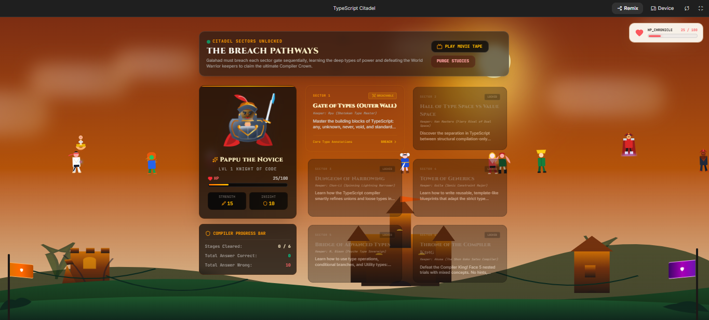

# TypeScript Citadel

## Game Link

The game currently lives in Google AI Studio. Here is the link [https://aistudio.google.com/apps/5913aca0-c6ad-40ea-8d65-5aaea753dae9?showPreview=true&showAssistant=true
](https://ai.studio/apps/5913aca0-c6ad-40ea-8d65-5aaea753dae9).

## Description

- It a game tha helps user learn Typescript
- It helps users learn 6 core principles of Typescript
- The game tries to teeach one principle at a time
- The game first teaches a lesson then takes a quiz
- The Player at the start is characterized as a Knight
- The Player fights against animated characters from the Street Fighter Game

## Game Preview

