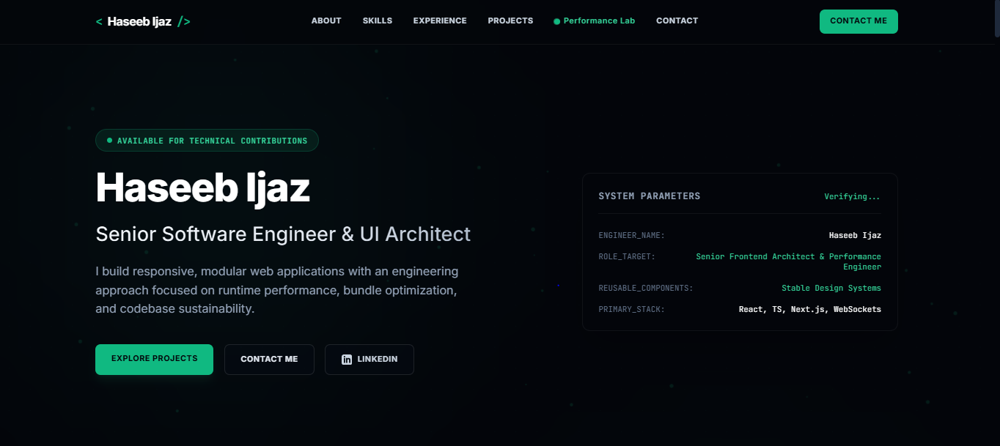

# Lec 6 Task - My Portfolio

This is a simple one-page personal portfolio website created using the Markdown → HTML workflow.

## Files & Folders

- `index.html` — Portfolio website
- `portfolio.md` — Portfolio Data
- `prompt.md` — Prompts
- `iterated_versions` — Iterations [HTML]

## Technologies

- Google AI Studio

## Author

Haseeb Ijaz

## Final Version Preview

