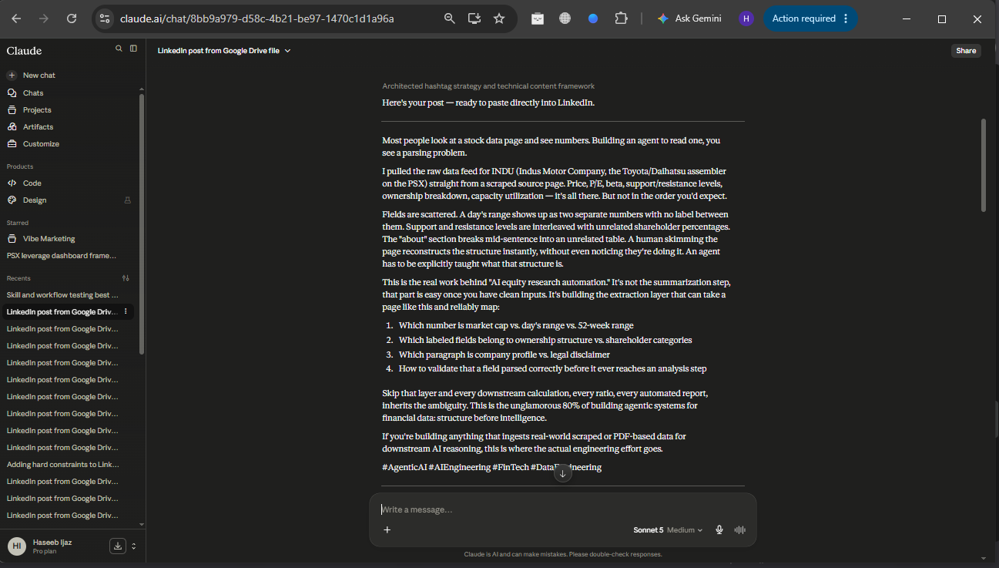

## Combined Workflow

It started with a simple ask: pull a file called INDU from the Agents folder in Google Drive and turn it into a LinkedIn post. No content was pasted in, no topic was named ahead of time — just a pointer to where the material lived.

The Google Drive connector went first. A search across the Agents folder turned up the file, a PSX market data snapshot for Indus Motor Company Limited — price action, valuation ratios, ownership structure, capacity utilization, the whole scraped profile page. The full content was pulled and read before anything else happened.

With real source material in hand, the linkedin-content-generator skill kicked in. Before touching a single word of copy, it ran its guard clauses: was there actual source material (yes — the Drive file), and was this genuinely a LinkedIn ask (yes — explicitly). Both cleared, so the request got classified: a single post, meant to land straight in the chat window, no document needed.

That classification wasn't acted on right away, though. First came a checkpoint — a plain restatement of what was found and what was about to happen, followed by one direct question: go ahead and draft this? Only after an explicit "Yes" did drafting actually begin.

The draft itself didn't invent anything new. Instead, it looked hard at the source file and noticed something real: the data wasn't clean. Fields were scattered, numbers sat next to unrelated numbers, paragraphs broke mid-sentence into tables. That messiness became the actual angle of the post — not a summary of INDU's stock price, but a story about the real engineering problem underneath any "AI equity research" pitch: structure before intelligence.

Before the post was finished, two more searches ran — one for career-positioning tags like Agentic AI and AI Engineer, one for content-specific tags tied to fintech and data engineering. The results were combined in a fixed order, career visibility first, and the reasoning behind that ordering was shown, not just applied silently.

What came out the other end was a ready-to-paste LinkedIn post, delivered in the chat, along with a short note on how the hashtags were chosen — closing the loop from "here's a file in Drive" to "here's a post you can publish."

## Sentence Used

```
Use Google Drive Connector.
In the Agents Folder, read the file INDU
and create me a linkedin post for it
```

## Screenshots


